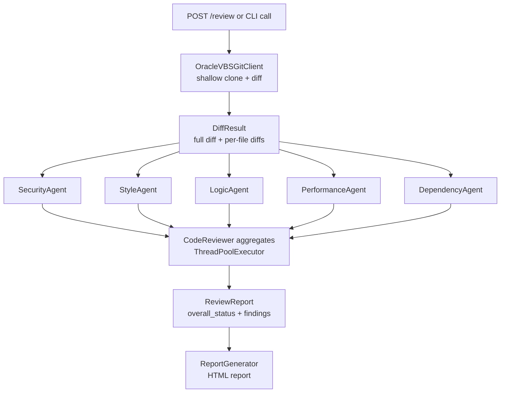

# OCI Gen AI Code Review System – Walkthrough

## What Was Built

A complete Python code review system that triggers when a merge request is created, fetches the diff between branches in **Oracle Visual Builder Studio**, runs it through **5 specialised AI agents** powered by **OCI Gen AI**, and produces a single self-contained **HTML report**.

---

## Project Structure

```
d:\Conneqtion Grp\Codes\DMCC\Code Reviewer\
│
├── .env                     ← PAT + VBS credentials (fill in GIT_USERNAME & VBS_REPO_URL)
├── .env.example             ← Template
├── requirements.txt         ← pip install -r requirements.txt
│
├── config.py                ← All settings + 50-item best-practices checklist
├── oci_client.py            ← OCI Gen AI wrapper (chat() method)
├── git_client.py            ← Oracle VBS Git client (shallow clone via PAT + GitPython)
│
├── agents/
│   ├── base_agent.py        ← Abstract agent: prompt building, chunking, parsing
│   ├── security_agent.py    ← OWASP, secrets, injection
│   ├── style_agent.py       ← PEP-8, naming, docstrings
│   ├── logic_agent.py       ← Error handling, edge cases
│   ├── performance_agent.py ← N+1, blocking I/O, memory
│   └── dependency_agent.py  ← requirements.txt changes
│
├── reviewer.py              ← Parallel orchestrator (ThreadPoolExecutor)
├── report_generator.py      ← Self-contained dark-mode HTML report
│
├── api.py                   ← Flask webhook server (POST /review)
├── main.py                  ← CLI tool (python main.py --help)
└── reports/                 ← Generated HTML reports land here
```

---

## Setup

### 1 – Install dependencies
```bash
pip install -r requirements.txt
```

### 2 – Configure [.env](file:///d:/Conneqtion%20Grp/Codes/DMCC/Code%20Reviewer/.env)
Open [.env](file:///d:/Conneqtion%20Grp/Codes/DMCC/Code%20Reviewer/.env) and fill in the two missing values:
```
GIT_USERNAME=your_vbs_email_or_username
VBS_REPO_URL=https://your-vbs-instance.com/org/project.git   # optional default
```
The `GIT_PAT` is already set.

### 3 – OCI credentials
Ensure `~/.oci/config` has a `[DEFAULT]` profile with your API key.

---

## Usage

### Option A – CLI (local testing)
```bash
python main.py \
  --repo  https://vbs.example.com/org/project.git \
  --source feature/my-feature \
  --target main \
  --pr-id 42
```
Generates `reports/review_42.html`.

### Option B – Flask API (webhook from CI/CD)
```bash
python api.py
```
Then POST from your Oracle VBS pipeline trigger or any CI tool:
```json
POST http://your-server:5000/review
{
  "repo_url":      "https://vbs.example.com/org/project.git",
  "source_branch": "feature/my-feature",
  "target_branch": "main",
  "pr_id":         "42"
}
```
Response:
```json
{
  "status": "success",
  "report_path": "...\\reports\\review_42.html",
  "summary": {
    "overall_status": "NEEDS WORK",
    "total_findings": 7,
    "severity_counts": {"CRITICAL":0,"HIGH":2,"MEDIUM":3,"LOW":2,"INFO":0},
    "elapsed_seconds": 21.4
  }
}
```

---

## How It Works



---

## Report Features

- **Dark-mode self-contained HTML** – open in any browser, no internet needed
- **Status badge** – `APPROVED` / `REVIEW REQUIRED` / `NEEDS WORK` / `BLOCKED`
- **Severity bar** – visual proportion of Critical / High / Medium / Low / Info
- **Per-agent collapsible sections** – expand any agent to see its findings
- **Full diff viewer** – syntax-highlighted unified diff embedded in the report
- **Changed files list** – Added / Modified / Deleted / Renamed files

---

## Best-Practices Checklist (50 rules across 5 categories)

| Category | Rules |
|---|---|
| Security | 10 – OWASP, secrets, SQL injection, SSL |
| Code Style | 10 – PEP-8, naming, docstrings, type hints |
| Logic | 10 – error handling, edge cases, async |
| Performance | 10 – DB queries, I/O, memory, logging |
| Dependencies | 5 – pinning, CVEs, license |

Rules live in `config.py → BEST_PRACTICES` and can be extended freely.

---

## OCI Connection Test
```bash
python oci_client.py
# Should print: OCI Test Response: OCI connection successful
```
